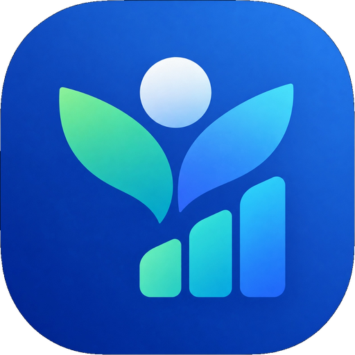
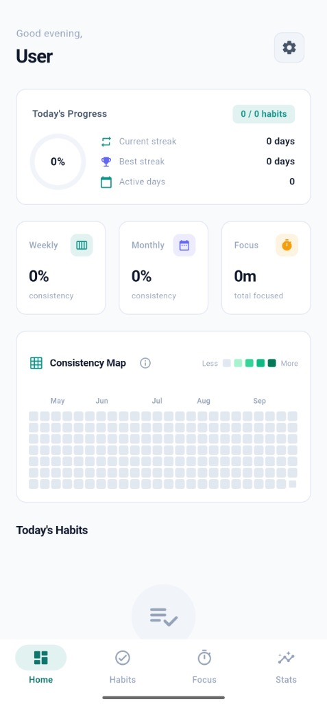
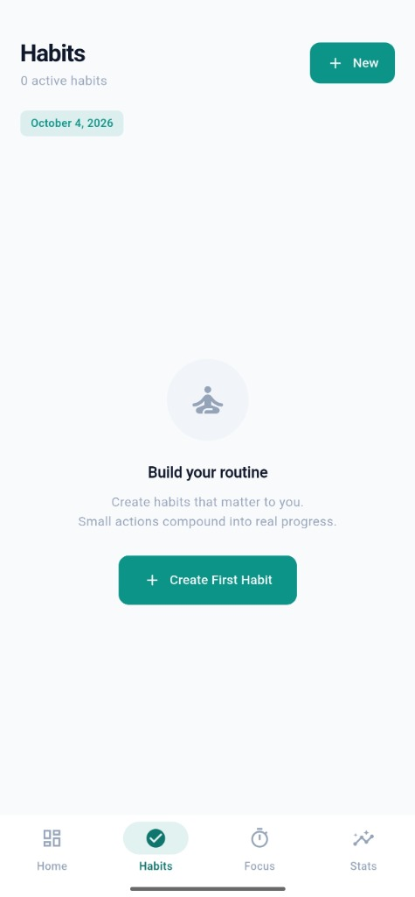
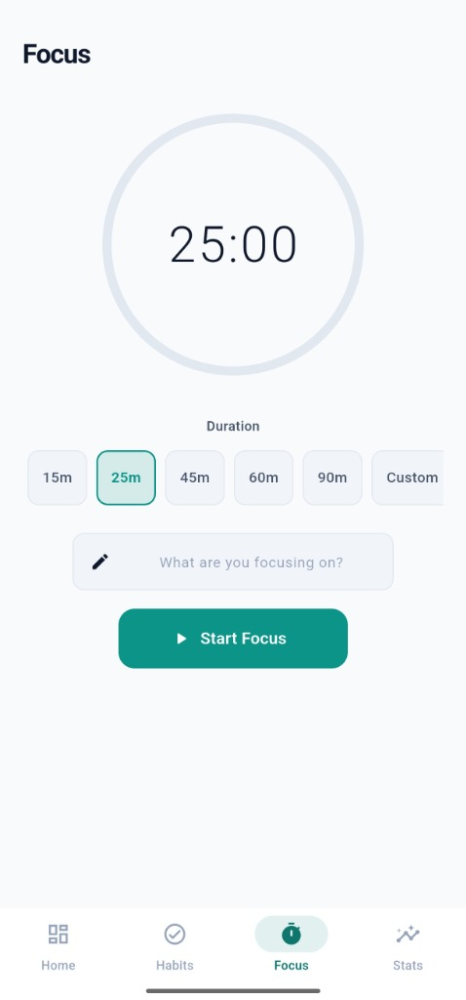
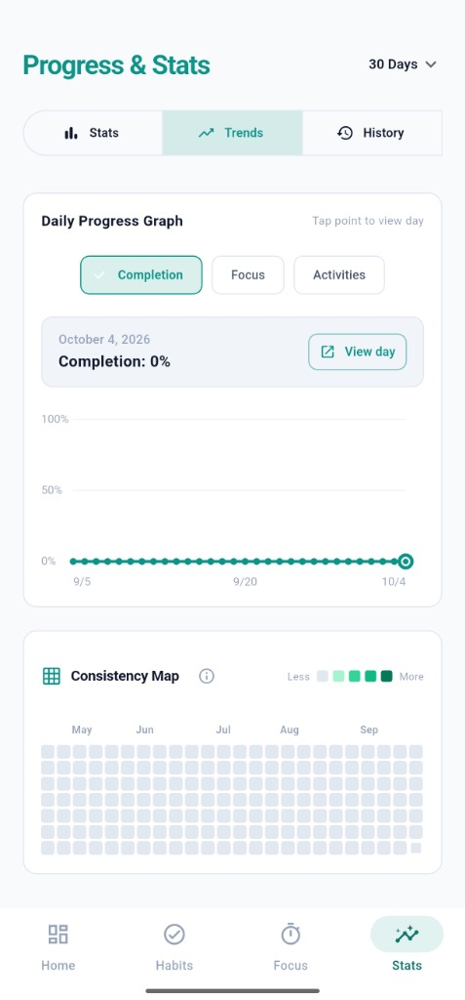
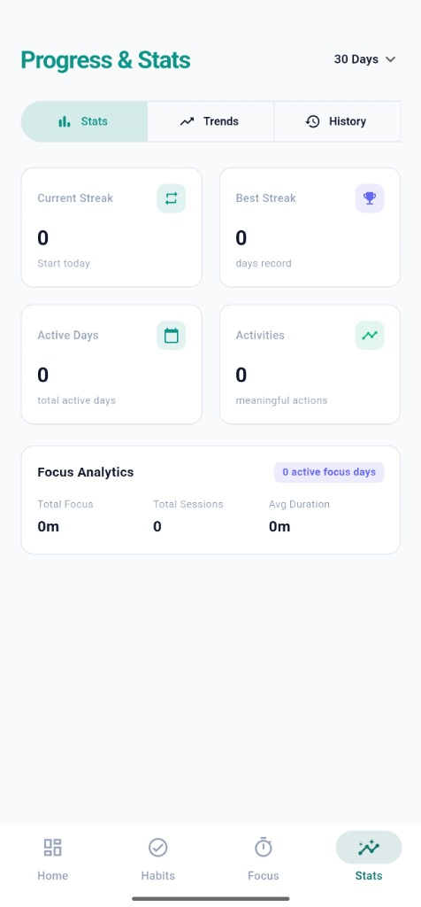
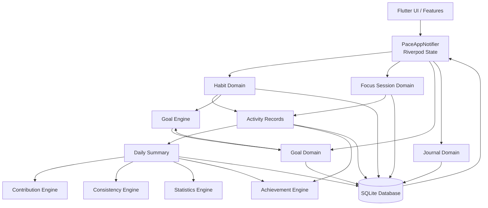

<div align="center">



# Pace

### Small actions. Real progress.

**A privacy-focused, offline-first consistency and progress tracking application built with Flutter.**

Track habits, focus sessions, long-term goals, milestones, journal entries, streaks, achievements, and personal progress from one unified system — without requiring an account, cloud backend, or subscription.

<br/>


[](https://github.com/abhi-s-aji/pace/blob/main/LICENSE)
[](https://github.com/abhi-s-aji/pace/stargazers)
[](https://flutter.dev/)
[](https://dart.dev/)
[](#testing)
[](#platform-support)

<br/>

[Features](#features) ·
[Architecture](#architecture) ·
[Installation](#installation) ·
[Testing](#testing) ·
[Roadmap](#roadmap)

</div>

---

## Table of Contents

* [Overview](#overview)
* [Why Pace?](#why-pace)
* [Features](#features)
* [How It Works](#how-it-works)
* [Screenshots](#screenshots)
* [Architecture](#architecture)
* [Technology Stack](#technology-stack)
* [Project Structure](#project-structure)
* [Data & Storage](#data--storage)
* [Privacy & Offline-First Design](#privacy--offline-first-design)
* [Platform Support](#platform-support)
* [Installation](#installation)
* [Usage](#usage)
* [Testing](#testing)
* [Build & Release](#build--release)
* [Roadmap](#roadmap)
* [Limitations](#limitations)
* [Contributing](#contributing)
* [License](#license)
* [Developer](#developer)
* [Blog](#blog)

---

# Overview

**Pace** is an offline-first personal consistency and progress tracking application designed around a simple idea:

> **Small actions. Real progress.**

Most productivity applications separate habit tracking, focus timers, goals, journaling, statistics, and achievement systems into different experiences.

Pace brings these concepts together into a single connected domain model.

A completed habit can contribute to daily activity.

A focus session can contribute to a habit and goal.

Daily activity can influence consistency metrics.

Goal progress can be connected to weighted habits and milestones.

Achievements can be evaluated from the same underlying activity data.

The result is a unified system for understanding **consistency over time**, rather than simply counting isolated tasks.

---

# Why Pace?

Traditional productivity tools often introduce several problems:

* Separate applications for habits, goals, focus, and journaling
* Important functionality hidden behind subscriptions
* Mandatory cloud accounts
* Limited ownership of personal productivity data
* Simple binary streaks that do not represent real consistency
* Fragmented statistics across multiple applications

Pace takes a different approach.

### Local-first

Core data is stored locally using SQLite.

### Connected domain model

Habits, activities, focus sessions, goals, milestones, journal entries, statistics, and achievements are connected.

### Meaningful consistency

Pace uses contribution metrics, consistency ratios, activity heatmaps, and grace-period streaks instead of relying only on binary streak counters.

### No mandatory account

The core application does not require authentication or a cloud backend.

### Data ownership by design

Your productivity data is designed to remain on your device unless you explicitly export or share it.

---

# Features

## Habit Tracking

Pace supports multiple habit types for different kinds of routines.

* Binary habits
* Quantity-based habits
* Duration-based habits
* Count-based habits
* Daily schedules
* Weekday schedules
* Custom schedules
* Categories
* Custom icons
* Accent colors
* Reminder times

---

## Focus Timer

A built-in focus timer connects focused work with the rest of the Pace domain.

Supported presets include:

* 25 minutes
* 45 minutes
* 60 minutes
* Custom duration

Focus sessions can optionally be linked to habits and contribute to the user's broader activity and goal progress.

Completed sessions can also include notes for later reflection.

---

## Long-Term Goals & Milestones

Pace allows users to define longer-term objectives and connect them to measurable daily actions.

Goals can include:

* Quantitative targets
* Qualitative objectives
* Weighted habit relationships
* Sub-goals
* Milestones
* Progress tracking
* Progress explanations

This creates a relationship between everyday actions and larger objectives.

```text
Goal
 ├── Milestone
 ├── Habit A ── Weight: 40%
 ├── Habit B ── Weight: 35%
 └── Habit C ── Weight: 25%
```

---

## Consistency Map

Pace includes a GitHub-style contribution heatmap for personal activity.

The system provides:

* Five activity intensity levels
* Active-day counts
* Weekly ratios
* Monthly ratios
* Historical activity visualization
* Consistency calculations
* Grace-period streak preservation

The goal is to visualize **long-term consistency**, not just whether something happened yesterday.

---

## Grace-Period Streaks

Traditional streak systems can be overly strict.

Missing a single day can completely destroy a long-term streak.

Pace uses a grace-period based approach to make streak tracking more representative of sustainable consistency.

The calculation engine evaluates activity according to the application's consistency rules rather than treating every missed day as an immediate failure.

---

## Achievement System

Pace contains **22 deterministic achievement badges** across **6 categories**.

Achievements are evaluated automatically from application data and persisted locally.

Examples of achievement criteria can be based on:

* Habit completion
* Consistency
* Focus activity
* Goal progress
* Streak milestones
* Long-term usage

The achievement system is deterministic rather than AI-generated.

---

## Journal & Mood Tracking

Pace includes date-bound personal reflection.

Users can record:

* Journal entries
* Daily thoughts
* Five-state mood values

Supported mood states:

```text
Great
Good
Neutral
Low
Tough
```

Journal entries remain associated with their corresponding dates.

---

## Local Notifications

Pace supports scheduled local notifications for reminders and habit-related activity.

The notification system includes:

* Scheduled reminders
* Quiet hours
* Completion-aware suppression

This helps prevent unnecessary reminder notifications after a habit has already been completed.

---

## Android Home Screen Widgets

Pace includes native Android home-screen widgets built with Kotlin and integrated through `home_widget`.

Available widgets include:

* Today Progress
* Habit Action
* Streak

These provide quick access to important information without requiring the full application to be opened.

> Android widgets are platform-specific functionality.

---

## Local Backup & Restore

Pace supports exporting application data as JSON.

This provides a local mechanism for:

* Data backup
* Data migration
* Data restoration
* Personal archival

The application does not require a cloud service to perform these operations.

---

## Personalization

Pace currently provides six selectable accent themes:

* Green
* Teal
* Indigo
* Purple
* Amber
* Crimson

---

# How It Works

The core workflow is designed around connecting small daily actions to larger outcomes.

```text
Set Goals
    |
    v
Create Habits / Milestones
    |
    v
Complete Habits
    |
    +------> Start Focus Session
    |
    v
Record Daily Activity
    |
    v
Update Daily Summary
    |
    +------> Contribution Score
    |
    +------> Consistency Metrics
    |
    +------> Goal Progress
    |
    +------> Achievement Evaluation
    |
    v
View History / Statistics / Heatmap
    |
    v
Reflect Through Journal & Mood
```

---

# Screenshots

<div align="center">
  <table>
    <tr>
      <td align="center" width="33%">
        
        <br/>
        <sub><b>Dashboard</b></sub>
      </td>
      <td align="center" width="33%">
        
        <br/>
        <sub><b>Habits</b></sub>
      </td>
      <td align="center" width="33%">
        
        <br/>
        <sub><b>Focus Timer</b></sub>
      </td>
    </tr>
    <tr>
      <td align="center" width="33%">
        
        <br/>
        <sub><b>Consistency Map</b></sub>
      </td>
      <td align="center" width="33%">
        
        <br/>
        <sub><b>Progress & Stats</b></sub>
      </td>
      <td align="center" width="33%">
        <br/>
        <sub><b>Productivity System</b></sub>
      </td>
    </tr>
  </table>
</div>

---

## Onboarding


---

## Dashboard

<div align="center">
  
</div>

---

## Habit Tracking

<div align="center">
  
</div>

---

## Focus Timer

<div align="center">
  
</div>

---

## Goals & Milestones


---

## Consistency Map

<div align="center">
  
</div>

---

## History


---

## Statistics

<div align="center">
  
</div>

---

## Achievements


---

# Architecture

Pace follows a **feature-based layered architecture** with centralized Riverpod state management and isolated domain calculation engines.



---

# Domain Engines

The application isolates major calculations into dedicated engines.

| Engine               | Responsibility                                                         |
| -------------------- | ---------------------------------------------------------------------- |
| `ContributionEngine` | Calculates daily contribution/activity scores                          |
| `ConsistencyEngine`  | Calculates consistency ratios, active days, and streak-related metrics |
| `GoalEngine`         | Calculates goal and milestone progress                                 |
| `AchievementEngine`  | Evaluates deterministic achievement criteria                           |
| `StatisticsEngine`   | Produces historical and statistical metrics                            |

This separation keeps business calculations independent from UI components.

---

# Technology Stack

| Category         | Technology                     |
| ---------------- | ------------------------------ |
| Framework        | Flutter                        |
| Language         | Dart                           |
| Native Android   | Kotlin                         |
| UI               | Material 3 + Custom Pace Theme |
| State Management | Riverpod 3                     |
| Database         | SQLite                         |
| Mobile Database  | `sqflite`                      |
| Desktop Database | `sqflite_common_ffi`           |
| Charts           | FL Chart                       |
| Notifications    | Flutter Local Notifications    |
| Android Widgets  | Home Widget                    |
| File Handling    | File Picker                    |
| Sharing          | Share Plus                     |
| Fonts            | Google Fonts                   |
| Testing          | Flutter Test                   |
| Version Control  | Git / GitHub                   |
| CI/CD            | GitHub Actions                 |

### Core Dependencies

```yaml
flutter_riverpod: ^3.4.3
sqflite: ^2.4.4
sqflite_common_ffi: ^2.4.3
fl_chart: ^1.2.0
flutter_local_notifications: ^18.0.1
home_widget: ^0.10.0
share_plus: ^13.0.0
file_picker: ^13.1.0
```

---

# Project Structure

```text
pace/
├── android/
│   └── Native Android source & Kotlin AppWidget receivers
│
├── assets/
│   └── images/
│       └── pace_logo.png
│
├── lib/
│   ├── app/
│   │   └── Application entry, theme and routing
│   │
│   ├── core/
│   │   ├── database/
│   │   │   └── SQLite database service & migrations
│   │   │
│   │   ├── domain/
│   │   │   └── Domain models & calculation engines
│   │   │
│   │   ├── notifications/
│   │   │   └── Local notification services
│   │   │
│   │   ├── state/
│   │   │   └── Riverpod providers & PaceAppNotifier
│   │   │
│   │   ├── theme/
│   │   │   └── PaceTheme & color palettes
│   │   │
│   │   └── widgets/
│   │       └── Reusable UI components
│   │
│   └── features/
│       ├── dashboard/
│       ├── focus/
│       ├── goals/
│       ├── habits/
│       ├── history/
│       ├── journal/
│       ├── progress/
│       └── settings/
│
├── test/
│   └── Unit & widget tests
│
├── pubspec.yaml
└── README.md
```

---

# Data & Storage

Pace uses a local SQLite database.

```text
pace_app_v1.db
Schema Version: 4
```

## Main Tables

| Table                 | Purpose                               |
| --------------------- | ------------------------------------- |
| `user_preferences`    | Stores local application preferences  |
| `habits`              | Stores habit definitions              |
| `habit_completions`   | Stores habit completion records       |
| `activities`          | Stores activity events                |
| `focus_sessions`      | Stores focus session data             |
| `goals`               | Stores long-term goals                |
| `goal_habit_links`    | Connects habits to goals with weights |
| `milestones`          | Stores goal milestones                |
| `journal_entries`     | Stores date-bound journal entries     |
| `daily_summaries`     | Stores aggregated daily metrics       |
| `earned_achievements` | Stores unlocked achievements          |

### Relationship Overview

```text
Habits
   |
   +------ Habit Completions
   |
   +------ Activities
   |
   +------ Goal Habit Links ------ Goals
                                      |
                                      +------ Milestones

Activities
   |
   v
Daily Summaries
   |
   +------ Contribution Metrics
   +------ Consistency Metrics
   +------ Statistics
   +------ Achievement Evaluation
```

---

# Privacy & Offline-First Design

Pace is designed around local-first data ownership.

### No backend required

The core application does not require:

* A cloud server
* A remote database
* User authentication
* External APIs
* A mandatory online account

### Local persistence

Application data is stored locally using SQLite.

### Explicit data export

Users can export their data as JSON when they want to create a backup or move their information.

### No mandatory cloud synchronization

Cloud synchronization is intentionally outside the current architecture.

This means the application's core productivity workflow can operate without depending on an external service.

---

# Platform Support

| Platform | Support   |
| -------- | --------- |
| Android  | Supported |

> Platform-specific capabilities may vary. Android home-screen widgets are available only on Android.

### Android Minimum Version

Android 7.0+ / API 24+

---

# Installation

## Prerequisites

Make sure the following are installed:

* Flutter SDK `3.12.2` or compatible version
* Dart SDK compatible with the project
* Android SDK for Android development
* Git

Verify Flutter:

```bash
flutter --version
```

---

## Clone the Repository

```bash
git clone https://github.com/abhi-s-aji/pace.git
cd pace
```

---

## Install Dependencies

```bash
flutter pub get
```

---

## Run the Application

```bash
flutter run
```

---

# Usage

After launching Pace:

1. Complete the initial onboarding.
2. Create your first habit.
3. Create a long-term goal if required.
4. Link habits to goals when appropriate.
5. Complete habits throughout the day.
6. Use the Focus Timer for dedicated work sessions.
7. Record thoughts and mood through the Journal.
8. Review your Dashboard and Consistency Map.
9. Explore historical Statistics.
10. Unlock achievements through consistent activity.
11. Export your data as JSON when you need a backup.

---

# Development Commands

### Run

```bash
flutter run
```

### Get Dependencies

```bash
flutter pub get
```

### Analyze

```bash
flutter analyze
```

### Run Tests

```bash
flutter test
```

### Build Android APK

```bash
flutter build apk --release
```

---

# Testing

Pace uses Flutter's testing framework for unit and widget testing.

## Latest Verification

```text
flutter analyze
0 issues

flutter test
54/54 tests passing
```

The test suite covers application logic and widget behavior across important parts of the system.

Run the complete test suite with:

```bash
flutter test
```

---


# Roadmap

## Completed

* [x] Binary habit tracking
* [x] Quantity habit tracking
* [x] Duration habit tracking
* [x] Count habit tracking
* [x] Custom habit schedules
* [x] Focus Timer
* [x] Weighted goal relationships
* [x] Goal milestones
* [x] Consistency heatmap
* [x] Grace-period streak system
* [x] Daily journal
* [x] Mood tracking
* [x] 22 achievement badges
* [x] Local notifications
* [x] Android home-screen widgets
* [x] JSON backup and restore
* [x] Multiple accent themes
* [x] Historical statistics

## Planned

* [ ] Native iOS WidgetKit extensions
* [ ] Automated backup schedules
* [ ] CSV export for statistical data
* [ ] Further platform-specific improvements

---

# Limitations

Pace intentionally does not currently provide:

* Cloud synchronization
* Remote user accounts
* Social feeds
* Social activity sharing
* Cloud-based productivity analytics

These limitations are part of the current local-first architecture rather than missing core requirements.

---

# Contributing

Pace is an open-source project and contributions are welcome.

If you would like to contribute:

1. Fork the repository.
2. Create a feature branch.

```bash
git checkout -b feature/your-feature
```

3. Make your changes.
4. Run the analyzer.

```bash
flutter analyze
```

5. Run the test suite.

```bash
flutter test
```

6. Commit your changes.

```bash
git commit -m "feat: add your feature"
```

7. Push the branch.

```bash
git push origin feature/your-feature
```

8. Open a Pull Request.

Please keep contributions focused, maintainable, and consistent with the existing architecture.

---

# License

Pace is released under the **MIT License**.

See the [LICENSE](LICENSE) file for the complete license text.

---

# Developer

<div align="center">

## Abhi S Aji

Computer Science undergraduate and software developer focused on building practical, maintainable applications.

<br/>

[](https://github.com/abhi-s-aji)
[](https://www.linkedin.com/in/abhi-s-aji-eden/)
[](https://hashnode.com/@abhi-s-aji)

</div>

---

# Project Links

| Resource         | Link                                                             |
| ---------------- | ---------------------------------------------------------------- |
| Repository       | [github.com/abhi-s-aji/pace](https://github.com/abhi-s-aji/pace) |
| Developer GitHub | [github.com/abhi-s-aji](https://github.com/abhi-s-aji)           |
| LinkedIn         | [Abhi S Aji](https://www.linkedin.com/in/abhi-s-aji-eden/)       |
| Hashnode         | [@abhi-s-aji](https://hashnode.com/@abhi-s-aji)                  |

---

# Credits

Pace is built using and inspired by the following open-source technologies and ecosystems:

* [Flutter](https://flutter.dev/)
* [Dart](https://dart.dev/)
* [Riverpod](https://riverpod.dev/)
* [sqflite](https://pub.dev/packages/sqflite)
* [FL Chart](https://pub.dev/packages/fl_chart)
* [Flutter Local Notifications](https://pub.dev/packages/flutter_local_notifications)
* [Home Widget](https://pub.dev/packages/home_widget)
* [Material Design](https://m3.material.io/)

---

<div align="center">

### Pace

**Small actions. Real progress.**

Built with Flutter, Dart, SQLite, and a focus on consistency.

[GitHub](https://github.com/abhi-s-aji/pace) ·
[Developer](https://github.com/abhi-s-aji) ·
[LinkedIn](https://www.linkedin.com/in/abhi-s-aji-eden/) ·
[Hashnode](https://hashnode.com/@abhi-s-aji)

</div>
